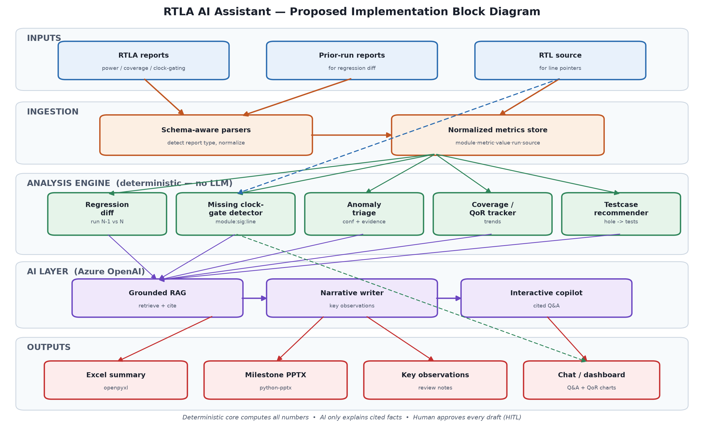

# RTLA AI Assistant

**Automated Reporting Today, Intelligent Design Guidance Tomorrow.**

An AI-powered engineering copilot for silicon design teams that turns raw **RTL Analysis (RTLA)** outputs into consolidated reports, milestone review decks, and — most importantly — **actionable design insights**: missing clock-gate detection, cross-run regression diffs, anomaly triage, and testcase recommendations.

> Built for **Microsoft Global Hackathon 2026** · Challenges: *Reimagine the Future of Work* + *Hack for Responsible AI* · Stack: **Azure OpenAI**

---

## The problem

Every milestone, RTL designers and verification engineers spend **hours** manually:

- Consolidating dozens of RTLA report files into a single Excel summary.
- Hand-building milestone review PowerPoint decks.
- Eyeballing power, performance, coverage, and clock-gating numbers to spot regressions and anomalies.
- Cross-referencing results across runs to explain *what changed and why*.

This is repetitive, error-prone, and pulls senior engineers away from actually solving design problems.

## What RTLA AI Assistant does

| Stage | Capability | Value |
|-------|-----------|-------|
| **Today** | Auto-generate consolidated Excel summary + milestone PPTX + key-observations writeup from RTLA outputs | Hours → minutes per milestone |
| **Today** | Interactive Q&A over power / performance / coverage / clock-gating with **cited, grounded answers** | Trustworthy, no hallucinated numbers |
| **Next** | Cross-run regression diff with root-cause narrative | "Power ↑3.2% in `ciu_ctrl`, driven by X toggle activity" |
| **Next** | Missing clock-gate detection with **exact RTL line pointers** | Finds real bugs, not just summaries |
| **Vision** | Anomaly triage, testcase recommendation, QoR tracking, design-optimization guidance | A living design-intelligence platform |

## Why it's different

Most "AI assistants" are generic chat-over-documents. RTLA AI Assistant is **domain-native**:

1. **Schema-aware ingestion** of real RTLA report formats — not generic PDF chat.
2. **Deterministic numbers, AI for narrative** — metrics are computed in code; the LLM only *explains* them. No fabricated figures.
3. **Grounded & cited** — every insight links back to the source report cell/section.
4. **Finds bugs, not just words** — the missing clock-gate detector points to the exact module/signal/RTL line.
5. **Human-in-the-loop by design** — the agent proposes, the engineer approves. It drafts; it never decides.

## Architecture at a glance



The way I've designed this, the system reads top to bottom in five clean layers — and there's one idea holding the whole thing together: **the machine does the maths, the model does the talking.**

Here's the walkthrough the way I'd explain it to a fellow engineer:

- **Inputs.** We start with what every RTL team already has lying around after a run — the RTLA reports (power, coverage, clock-gating), the previous run's reports so we can compare, and the RTL source itself so we can point back to real lines of code.
- **Ingestion.** Instead of dumping PDFs into a chatbot, schema-aware parsers actually *understand* the report structure and flatten everything into one normalized metrics store — every value tagged with its module, its run, and exactly where it came from. That "where it came from" tag is what makes every later answer traceable.
- **Analysis engine — the deterministic heart.** This is where all the real thinking about numbers happens, and there is **no LLM here on purpose.** Five plain-code modules do the work: regression diff (what moved between runs), the missing clock-gate detector (our headline feature — it names the exact `module : signal : file:line`), anomaly triage, coverage/QoR tracking, and a testcase recommender. Because it's ordinary code, it's unit-testable and it can't hallucinate a power number.
- **AI layer (Azure OpenAI) — the only place a model lives.** The LLM is deliberately boxed in. Grounded RAG pulls the relevant computed facts, the narrative writer turns those facts into readable "key observations," and the interactive copilot answers questions — but always *from the cited data*, never from imagination. If there's no supporting data, it says so.
- **Outputs.** Finally the generators assemble the deliverables people actually want: a consolidated Excel summary, a milestone PowerPoint, a written observations page, and a chat/dashboard for live Q&A.

The dotted paths in the diagram show the two "special" routes: the RTL source feeding straight into the clock-gate detector, and the clock-gate findings surfacing directly on the dashboard so a designer sees the flagged line immediately.

**Why this shape wins:** every figure a reviewer sees was *computed*, not guessed; every sentence the AI writes is *cited* back to a source row; and nothing ships until a human approves it. That's automation you can actually trust with design decisions.

## Repository map

```
RtlaAssist/
├─ README.md                ← you are here
├─ docs/
│  ├─ 01-overview.md         ← problem, users, value
│  ├─ 02-architecture.md     ← system design + component diagram
│  ├─ 03-flows.md            ← end-to-end flows (Mermaid)
│  ├─ 04-features.md         ← detailed feature specs + status
│  ├─ 05-responsible-ai.md   ← grounding, HITL, safeguards
│  ├─ 06-roadmap.md          ← staged delivery plan
│  └─ 07-demo-script.md      ← 2-minute demo video script
├─ src/                      ← implementation (skeleton)
├─ samples/                  ← sample RTLA inputs & generated outputs
└─ assets/
   ├─ presentation/          ← drop the hackathon PPTX here
   ├─ video/                 ← drop the ≤2:00 demo video here
   └─ images/                ← screenshots / diagrams
```

---
*Microsoft Confidential — Internal hackathon project.*
