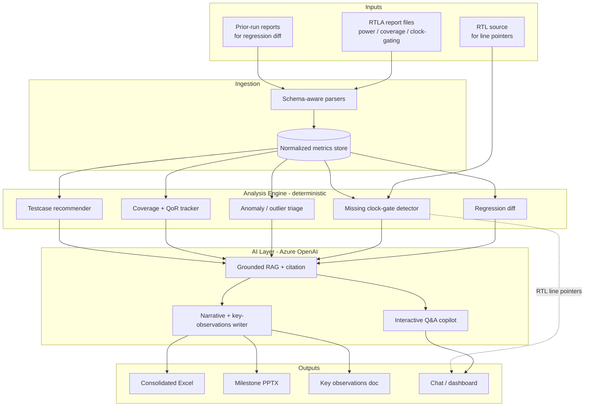

# 02 · Architecture

## Design principles

1. **Deterministic core, generative edge.** All metrics/deltas are computed in code. The LLM is used only to *explain, summarize, and recommend* — never to produce numbers.
2. **Grounded retrieval.** Every answer cites the source report cell/section.
3. **Schema-aware ingestion.** Parsers understand real RTLA report structure, not generic text.
4. **Human-in-the-loop.** The agent drafts artifacts and proposes actions; the engineer approves.
5. **Pluggable analyzers.** Each insight (clock-gate, power diff, coverage) is an independent module.

## Component diagram

*Rendered block diagram (source: `assets/images/gen_block_diagram.py`). The Mermaid version below is kept for GitHub inline rendering and easy editing.*

## Layers

### 1. Ingestion (schema-aware parsers)
- Detect RTLA report type and parse into a **normalized metric schema** (module, metric, value, unit, run-id, source-location).
- Store in a lightweight tabular store (Parquet / SQLite) keyed by run.

### 2. Analysis engine (deterministic, testable)
Pure functions over the normalized store — unit-testable, no LLM:
- **Regression diff** — per-module deltas between two runs.
- **Missing clock-gate detector** — cross-reference activity/enable data with RTL to flag free-running clocks; emit `module:signal:line`.
- **Anomaly triage** — statistical outliers with confidence + evidence rows.
- **Coverage / QoR tracker** — trends across milestones.
- **Testcase recommender** — map coverage holes → existing UVM tests / stimulus stubs.

### 3. AI layer (Azure OpenAI)
- **Grounded RAG** — retrieve relevant normalized rows + report sections; every claim carries a citation handle.
- **Narrative writer** — turns computed deltas/anomalies into readable "key observations".
- **Interactive copilot** — natural-language Q&A that always answers from retrieved, cited data.

### 4. Output generators
- **Excel** (openpyxl) — consolidated multi-sheet summary.
- **PPTX** (python-pptx) — milestone deck from a template.
- **Observations doc** — auto-written review notes.
- **Chat/dashboard UI** — Q&A + QoR trend charts.

## Tech stack (proposed)

| Concern | Choice |
|---------|--------|
| LLM | Azure OpenAI (GPT-4o / o-series) |
| Orchestration | Python + lightweight agent loop |
| Retrieval | Embeddings + local vector store (or Azure AI Search) |
| Data store | Parquet / SQLite (normalized metrics) |
| Excel / PPTX | openpyxl / python-pptx |
| UI | Streamlit or web app (chat + dashboard) |

## Data-flow contract

Every insight object carries: `claim`, `computed_value`, `source_run`, `source_location` (file + cell/section, and `module:signal:line` for RTL), and `confidence`. This contract is what makes answers auditable — see Responsible AI.
