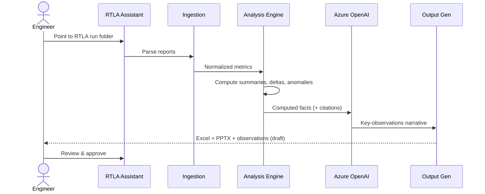
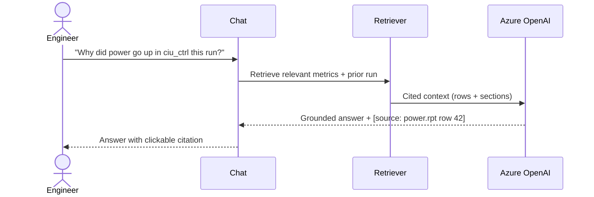
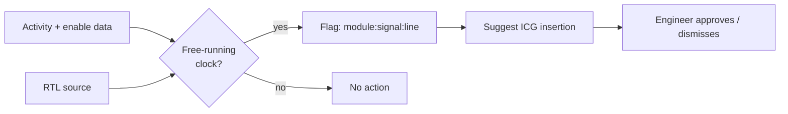
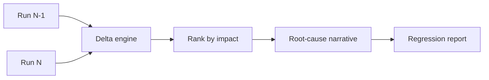
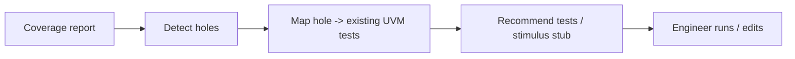

# 03 · End-to-end flows

## Flow A — Milestone report generation (the "today" hero flow)



**Steps**
1. Engineer selects a run folder (or the tool watches a results dir).
2. Parsers normalize every report into the metric schema.
3. Analysis engine computes per-module summaries, run-over-run deltas, and anomalies — **in code**.
4. AI layer writes the narrative *from the computed facts only*, attaching citations.
5. Generators emit the Excel summary, the milestone PPTX, and the key-observations doc.
6. Engineer reviews; nothing is "final" until approved.

## Flow B — Interactive analysis Q&A



Guardrail: if retrieval returns no supporting data, the copilot says *"I don't have data for that"* rather than guessing.

## Flow C — Missing clock-gate detection (the "wow" flow)



**Output example:**
```
⚠ Missing clock gate
  module : ciu_ctrl
  signal : data_reg[31:0]
  file   : ciu_ctrl.sv:214
  reason : register free-running while enable inactive 87% of cycles
  suggest: insert ICG on `data_reg` gated by `ciu_active`
  confidence: 0.82   [evidence: toggle.rpt rows 88–91]
```

## Flow D — Cross-run regression diff



Produces a ranked table (biggest power/coverage movers first) with an AI-written *why* for each, each line cited to source rows.

## Flow E — Testcase recommendation



Connects *analysis → action*: a coverage hole becomes a concrete "run these tests" recommendation.
