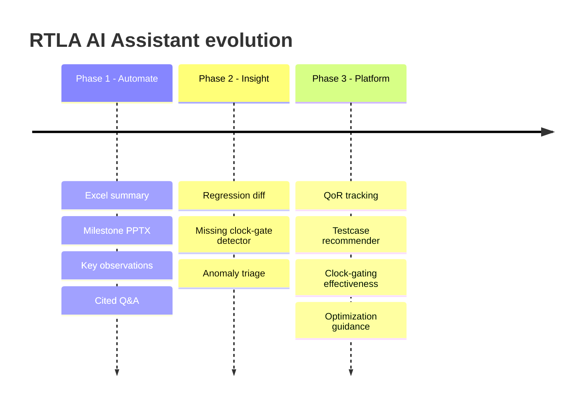

# 06 · Roadmap & delivery plan

## Staged vision

## Phase 1 — Automate (hackathon MVP)
- F1 Excel summary, F2 milestone PPTX, F3 key observations, F4 cited Q&A copilot.
- **Goal:** a working end-to-end demo on one real RTLA run.

## Phase 2 — Insight (the differentiators)
- F5 missing clock-gate detector (hero), F6 regression diff, F7 anomaly triage.
- **Goal:** the tool *finds* something a human would have missed.

## Phase 3 — Platform (design intelligence)
- F8 QoR tracking, F9 testcase recommender, F10 clock-gating effectiveness, F11 traffic comparisons, F12 optimization guidance.
- **Goal:** a living platform teams use every milestone.

---

## Judging-criteria mapping (self-check)

| Criterion | How we address it |
|-----------|-------------------|
| Impact | Hours saved/milestone + issues surfaced, on a real team pain point |
| Innovation | Domain-native analyzers (clock-gate/line pointers), not generic chat |
| Technical execution | Deterministic engine + grounded RAG + real generated artifacts |
| Responsible AI | Cited, HITL, no fabricated numbers (challenge tag) |
| Clarity of demo | 2-min hero-moment video + before/after |
